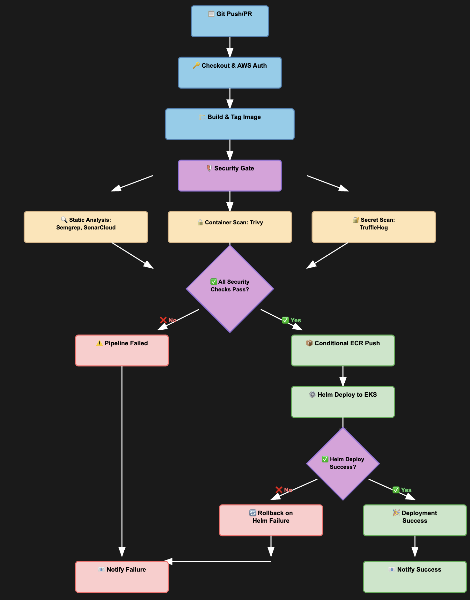

# 🚀 Secure Microservice Demo – DevSecOps Assessment

This repository demonstrates a secure, production-ready microservice architecture implementing modern **DevSecOps best practices** using:

- 🐳 Docker & Docker Compose (local development)
- 🕸️ Node.js + MongoDB Microservice
- ☁️ AWS Infrastructure via Terraform (EKS, ALB, DocumentDB, WAF)
- 🔐 Secrets Management using AWS Secrets Manager
- ⚙️ CI/CD via GitHub Actions with integrated security gates (Semgrep, Trivy, Dockle, SonarCloud)

---

## 📦 Project Structure

```bash
.
├── web-app/                   # Node.js microservice
│   ├── Dockerfile             # Multi-stage, non-root Docker build
│   ├── docker-compose.yml     # Local development
├── helm/                      # Helm chart for Kubernetes deployment
│   ├── templates/             # K8s manifests (Ingress, Deployment, etc.)
│   └── values.yaml            # Configurable values
├── terraform/
│   ├── environment/prod/      # Terraform configuration for AWS EKS, ALB, Secrets Manager, etc.
│   └── modules/               # Modular infrastructure (vpc, eks, efs, docdb, etc.)
├── .github/workflows/
│   └── deploy.yaml            # GitHub Actions pipeline
├── flow-daigram.png           # DevSecOps CI/CD pipeline diagram
└── README.md
```

---

## 🔧 Local Development (Docker Compose)

### ▶️ Quick Start

```bash
git clone https://github.com/<your-username>/secure-microservice-demo.git
cd secure-microservice-demo/web-app

docker-compose up --build
```

### ✅ Test the API

```bash
curl http://localhost:3000/health
curl http://localhost:3000/
```

Or open the above URLs in your browser.

### 🛑 Stop Docker Container

```bash
docker-compose down -v
```

---

## 🔄 CI/CD Pipeline Flow

This diagram represents the GitHub Actions pipeline, where each step must pass security checks before deploying to production.



---

## 🛠️ Production Deployment (Terraform + AWS + Helm)

### 1️⃣ Deploy AWS Infrastructure

```bash
cd terraform/environment/prod
terraform init
terraform apply -var-file=terraform.tfvars
```

**This provisions:**

- Amazon EKS (Kubernetes Cluster)
- AWS Application Load Balancer (via Ingress)
- Amazon DocumentDB (MongoDB-compatible)
- AWS Secrets Manager (for Mongo URI)
- Amazon EFS (persistent shared storage)
- AWS WAF, IAM, Route 53, and other security constructs

---

### 2️⃣ Build & Push Docker Image

Handled via CI/CD GitHub Actions pipeline with integrated security checks.

---

## 🔐 Security Features

- 🛡️ **Container Hardening:** Alpine base image, non-root user, read-only FS, dropped Linux capabilities
- 🧠 **Static Code Analysis:** Semgrep, SonarCloud integrated in CI
- 🔒 **Secrets Management:** AWS Secrets Manager (Mongo URI injected via Helm)
- 🌐 **App Security:** Helmet (CSP headers), rate limiting, input validation, CORS
- 🔍 **Container Scanning:** Trivy and Dockle in pipeline
- ⚖️ **IAM Least Privilege:** Terraform-managed IAM roles and policies
- 🔌 **Network Isolation:** Kubernetes namespaces + network policies
- 📦 **Resource Limits:** Defined in Helm `values.yaml`

---

## ⚙️ CI/CD Workflow (GitHub Actions)

### Pipeline Steps

- Checkout & AWS Auth
- Build & Tag Docker Image
- Static Analysis: Semgrep, SonarCloud
- Container Scan: Trivy, Dockle
- Secret Scan: TruffleHog
- Conditional ECR Push (on security gate pass)
- Helm Deploy to EKS
- Rollback on Helm Failure

---

## 🔐 Required GitHub Secrets

Set the following in your GitHub repository secrets:

- `AWS_ACCESS_KEY_ID`
- `AWS_SECRET_ACCESS_KEY`
- `AWS_REGION`
- `SONAR_TOKEN`
- `SEMGREP_APP_TOKEN`

---

## 📊 Monitoring & Alerting

| Tool         | Purpose                                |
|--------------|----------------------------------------|
| Prometheus   | Metrics collection (infra + app)       |
| Grafana      | Real-time dashboards                   |
| Alertmanager | Slack/Email/PagerDuty alerts           |

**Metrics Monitored:**

- API latency, error rates, request volume
- Pod restarts, CPU/memory usage, disk I/O
- EFS usage, ALB health, ingress latency

---

## 🛡️ Security Scanning (Manual / CLI)

```bash
# Terraform security scan
Checkov scan terraform/
```

---

## ✅ Deliverables

- Hardened Dockerfile (multi-stage, no root)
- GitHub Actions pipeline (CI/CD + security gates)
- AWS Infrastructure via Terraform (EKS, ALB, DocumentDB)
- Secure secrets management via AWS Secrets Manager
- Helm charts for Kubernetes deployment
- Monitoring via Prometheus + Grafana
- PDF report documenting implementation (optional)
- This README

---

## 🧠 Final Notes

This project demonstrates end-to-end DevSecOps principles:

- 🔁 **Shift-left security:** Early detection of issues in CI
- 📜 **IaC:** Declarative and repeatable infrastructure
- 🔐 **Secure-by-default:** Containers, credentials, network, and RBAC
- 📈 **Scalability:** Autoscaling enabled via EKS HPA
- 👀 **Observability:** Integrated monitoring & alerting stack

---

## 👤 Author

**Ayushi Shrotriya**
